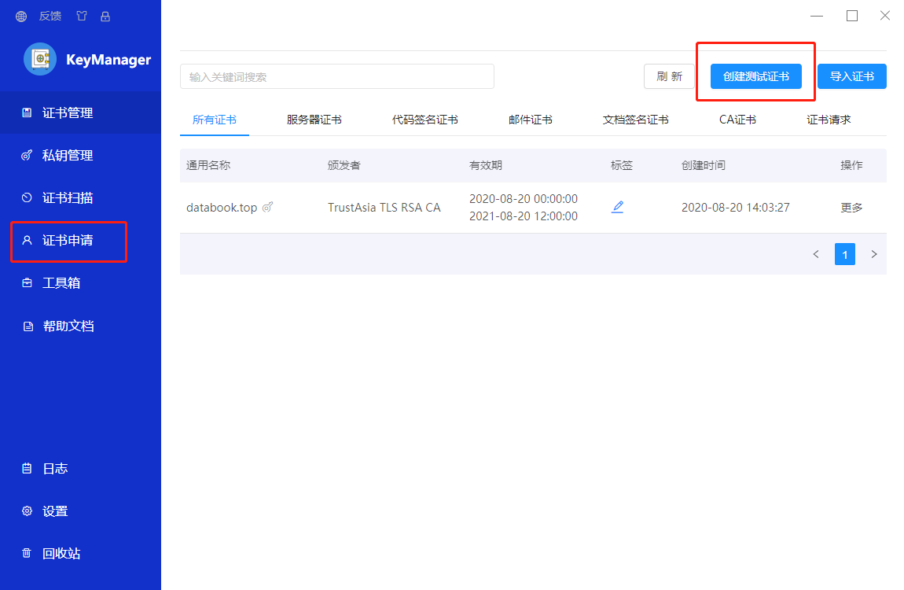

# 概述
目前, https 几乎已经是 web 站点的标配了, http 的站点和服务少之又少.
所以, 现在发布站点或者服务, https 是绕不开的一个点.

其实, 发布 https 还是 http, 对代码来说, 基本没有变化.
https 难度的更多的是在如何创建和部署 SSL 证书上.

下面, 通过简单的例子来演示如何将一个简单 golang gin 服务部署成 https 服务.


# https 证书的生成
证书的生成和具体的代码没有任何关系.


## 第一步：下载证书生成软件
通过 keymanager 来生成证书.

下载安装 keymanager 之后, 打开界面如下:


这里面有 1 个证书, 是我之前创建的, 新安装之后应该是空的.
这时, 你可以点击 【创建测试证书】 创建一个测试证书来实验发布 https 服务，
也可以点击 【证书申请】，申请一个真正的 https 证书(需要 freeSSL 帐号，也是免费的)


## 第二步：创建测试证书
本文主要演示 https 服务的发布过程，避免多余的步骤，所以使用测试证书。用真实证书的也一样，只是申请的过程有区别。
点击 【创建测试证书】之后，只要输入域名，然后点击下面的【创建证书】按钮即可。


## 第三步：导出证书
在证书列表页面点击【更多】，选择【导出证书】


选择 IIS 格式，并且输入密钥，作为测试我输入的是【12345678】


## 总结

借助 keymanager 工具，证书的制作非常简单，到这里为止，证书就算制作完成并导出了。

# https 证书在 gin 框架中的部署

## 构建简单的 web 服务
为了验证证书是否可用，创建一个简单的基于 gin 框架的 web 服务。

```go
    package main
    
    import (
      "strconv"
    
      "github.com/gin-gonic/gin"
      "github.com/unrolled/secure"
    )
    
    func main() {
      GinHttps(false) // 这里false 表示 http 服务，非 https
    }
    
    func GinHttps(isHttps bool) error {
    
      r := gin.Default()
      r.GET("/test", func(c *gin.Context) {
        c.String(200, "test for 【%s】", "https")
      })
    
      if isHttps {
        r.Use(TlsHandler(8000))
    
        return r.RunTLS(":"+strconv.Itoa(8000), "/path/to/test.pem", "/path/to/test.key")
      }
    
      return r.Run(":" + strconv.Itoa(8000))
    }
    
    func TlsHandler(port int) gin.HandlerFunc {
      return func(c *gin.Context) {
        secureMiddleware := secure.New(secure.Options{
          SSLRedirect: true,
          SSLHost:     ":" + strconv.Itoa(port),
        })
        err := secureMiddleware.Process(c.Writer, c.Request)
    
        // If there was an error, do not continue.
        if err != nil {
          return
        }
    
        c.Next()
      }
    }

```
刚开始，以 http 的方式运行，启动后再浏览器输入 http://localhost:8000/test


## 证书转换
导出的 IIS 格式的证书无法直接使用，使用以下命令转换出相应的 pem 和 key 文件即可。

```bash
    openssl pkcs12 -in test.pfx -nocerts -out key.pem -nodes
    openssl pkcs12 -in test.pfx -nokeys -out test.pem
    openssl rsa -in key.pem -out test.key

```

## 改成 https 服务
只需将 main 函数中的调用参数改成 true 即可，其他不用变。
注意上面步骤转换出的 pem 和 key 文件的路径要放对。
```go

func main() {
  GinHttps(true) // 这里true 表示 https 服务
}

```
