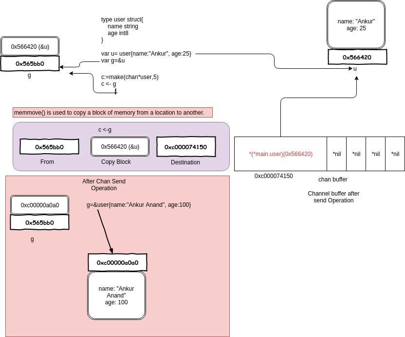
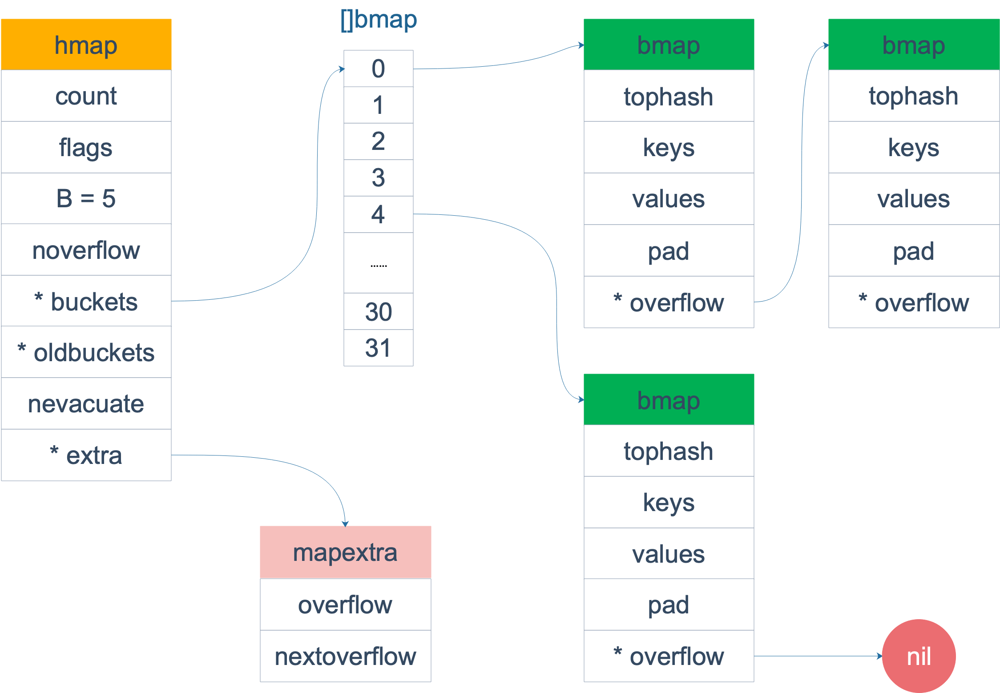

[go-questions地址](https://www.topgoer.cn/docs/goquestions/goquestions-1cjh24lli0ear)

 # Channel

## channel01:从一个关闭的channel仍然能够读出数据吗？

从一个有缓冲的 channel 里读数据，当 channel 被关闭，依然能读出有效值。只有当返回的 ok 为 false 时，读出的数据才是无效的。

[channel01](channel/channel01/main.go)

```
received: 19
channel closed,data invalid.
```
## channel02:channel有哪些应用? 

### 任务定时
[ticker](channel/channel02/ticker/ticker.go)

### 解藕生产方和消费方

[worker_consumer](channel/channel02/worker_consumer/main.go)
```
finish task : 1 by worker 4 
finish task : 0 by worker 0 
finish task : 2 by worker 1 
finish task : 3 by worker 3 
finish task : 4 by worker 2 
finish task : 5 by worker 0 
finish task : 8 by worker 3 
finish task : 9 by worker 4 
finish task : 7 by worker 2 
finish task : 6 by worker 1 
```

### 控制并发数
有时需要定时执行几百个任务，例如每天定时按城市来执行一些离线计算的任务。
但是并发数又不能太高，因为任务执行过程依赖第三方的一些资源，对请求的速率有限制。
这时就可以通过 channel 来控制并发数。

```go
var limit = make(chan int, 3)

func main() {
    // …………
    for _, w := range work {
        go func() {
            limit <- 1
            w()
            <-limit
        }()
    }
    // …………
}
```
构建一个缓冲型的 channel，容量为 3。接着遍历任务列表，每个任务启动一个 goroutine 去完成。
真正执行任务，访问第三方的动作在 w() 中完成，在执行 w() 之前，先要从 limit 中拿“许可证”，
拿到许可证之后，才能执行 w()，并且在执行完任务，要将“许可证”归还。这样就可以控制同时运行的 goroutine 数。

这里，limit <- 1 放在 func 内部而不是外部，原因是：

> 如果在外层，就是控制系统 goroutine 的数量，可能会阻塞 for 循环，影响业务逻辑。

> limit 其实和逻辑无关，只是性能调优，放在内层和外层的语义不太一样。

还有一点要注意的是，如果 w() 发生 panic，那“许可证”可能就还不回去了，因此需要使用 defer 来保证。
## channel03:如何优雅地关闭channel?

关于 channel 的使用，有几点不方便的地方：

    在不改变 channel 自身状态的情况下，无法获知一个 channel 是否关闭。
    关闭一个 closed channel 会导致 panic。所以，如果关闭 channel 的一方在不知道 channel 是否处于关闭状态时就去贸然关闭 channel 是很危险的事情。
    向一个 closed channel 发送数据会导致 panic。所以，如果向 channel 发送数据的一方不知道 channel 是否处于关闭状态时就去贸然向 channel 发送数据是很危险的事情。

一个比较粗糙的检查 channel 是否关闭的函数：

[channel_close01](channel/channel03/channel_close01/main.go)


看一下代码，其实存在很多问题。首先，IsClosed 函数是一个有副作用的函数。每调用一次，都会读出 channel 里的一个元素，改变了 channel 的状态。这不是一个好的函数，干活就干活，还顺手牵羊！

其次，IsClosed 函数返回的结果仅代表调用那个瞬间，并不能保证调用之后会不会有其他 goroutine 对它进行了一些操作，改变了它的这种状态。例如，IsClosed 函数返回 true，但这时有另一个 goroutine 关闭了 channel，
而你还拿着这个过时的 “channel 未关闭”的信息，向其发送数据，就会导致 panic 的发生。当然，一个 channel 不会被重复关闭两次，如果 IsClosed 函数返回的结果是 true，说明 channel 是真的关闭了。

有一条广泛流传的关闭 channel 的原则：

    don’t close a channel from the receiver side and don’t close a channel if the channel has multiple concurrent senders.

不要从一个 receiver 侧关闭 channel，也不要在有多个 sender 时，关闭 channel。

比较好理解，向 channel 发送元素的就是 sender，因此 sender 可以决定何时不发送数据，并且关闭 channel。但是如果有多个 sender，某个 sender 同样没法确定其他 sender 的情况，这时也不能贸然关闭 channel。

但是上面所说的并不是最本质的，最本质的原则就只有一条：

    don’t close (or send values to) closed channels.

有两个不那么优雅地关闭 channel 的方法：

    使用 defer-recover 机制，放心大胆地关闭 channel 或者向 channel 发送数据。即使发生了 panic，有 defer-recover 在兜底。
    
    使用 sync.Once 来保证只关闭一次。

那到底应该如何优雅地关闭 channel？

根据 sender 和 receiver 的个数，分下面几种情况：

    一个 sender，一个 receiver
    一个 sender， M 个 receiver
    N 个 sender，一个 reciver
    N 个 sender， M 个 receiver

对于 1，2，只有一个 sender 的情况就不用说了，直接从 sender 端关闭就好了，没有问题。重点关注第 3，4 种情况。

第 3 种情形下，优雅关闭 channel 的方法是：
    the only receiver says “please stop sending more” by closing an additional signal channel。

解决方案就是增加一个传递关闭信号的 channel，receiver 通过信号 channel 下达关闭数据 channel 指令。senders 监听到关闭信号后，停止接收数据。

[channel_close02](channel/channel03/channel_close02/main.go)


这里的 stopCh 就是信号 channel，它本身只有一个 sender，因此可以直接关闭它。senders 收到了关闭信号后，select 分支 “case <- stopCh” 被选中，退出函数，不再发送数据。

需要说明的是，上面的代码并没有明确关闭 dataCh。在 Go 语言中，对于一个 channel，如果最终没有任何 goroutine 引用它，不管 channel 有没有被关闭，最终都会被 gc 回收。所以，在这种情形下，所谓的优雅地关闭 channel 就是不关闭 channel，让 gc 代劳。

最后一种情况，优雅关闭 channel 的方法是：any one of them says “let’s end the game” by notifying a moderator to close an additional signal channel。

和第 3 种情况不同，这里有 M 个 receiver，如果直接还是采取第 3 种解决方案，由 receiver 直接关闭 stopCh 的话，就会重复关闭一个 channel，导致 panic。因此需要增加一个中间人，M 个 receiver 都向它发送关闭 dataCh 的“请求”，中间人收到第一个请求后，就会直接下达关闭 dataCh 的指令（通过关闭 stopCh，这时就不会发生重复关闭的情况，因为 stopCh 的发送方只有中间人一个）。
另外，这里的 N 个 sender 也可以向中间人发送关闭 dataCh 的请求。

[channel_close03](channel/channel03/channel_close03/main.go)

代码里 toStop 就是中间人的角色，使用它来接收 senders 和 receivers 发送过来的关闭 dataCh 请求。
这里将 toStop 声明成了一个 缓冲型的 channel。假设 toStop 声明的是一个非缓冲型的 channel，
那么第一个发送的关闭 dataCh 请求可能会丢失。因为无论是 sender 还是 receiver 都是通过 select 语句来发送请求，
如果中间人所在的 goroutine 没有准备好，那 select 语句就不会选中，直接走 default 选项，什么也不做。
这样，第一个关闭 dataCh 的请求就会丢失。

如果，我们把 toStop 的容量声明成 Num(senders) + Num(receivers)，那发送 dataCh 请求的部分可以改成更简洁的形式：
```go
    ...
    toStop := make(chan string, NumReceivers + NumSenders)
    ...
                value := rand.Intn(Max)
                if value == 0 {
                    toStop <- "sender#" + id
                    return
                }
    ...
                    if value == Max-1 {
                        toStop <- "receiver#" + id
                        return
                    }
    ...
```
## channel04:channel在什么情况下会引起资源泄露？

Channel 可能会引发 goroutine 泄漏。

泄漏的原因是 goroutine 操作 channel 后，处于发送或接收阻塞状态，而 channel 处于满或空的状态，一直得不到改变。同时，垃圾回收器也不会回收此类资源，进而导致 gouroutine 会一直处于等待队列中，不见天日。

另外，程序运行过程中，对于一个 channel，如果没有任何 goroutine 引用了，gc 会对其进行回收操作，不会引起内存泄漏。

## channel05:什么是CSP?
不要通过共享内存来通信，而要通过通信来实现内存共享。

这就是 Go 的并发哲学，它依赖 CSP 模型，基于 channel 实现。

CSP 经常被认为是 Go 在并发编程上成功的关键因素。CSP 全称是 “Communicating Sequential Processes”，这也是 Tony Hoare 在 1978 年发表在 ACM 的一篇论文。论文里指出一门编程语言应该重视 input 和 output 的原语，尤其是并发编程的代码。

在那篇文章发表的时代，人们正在研究模块化编程的思想，该不该用 goto 语句在当时是最激烈的议题。彼时，面向对象编程的思想正在崛起，几乎没什么人关心并发编程。

在文章中，CSP 也是一门自定义的编程语言，作者定义了输入输出语句，用于 processes 间的通信（communicatiton）。processes 被认为是需要输入驱动，并且产生输出，供其他 processes 消费，processes 可以是进程、线程、甚至是代码块。输入命令是：!，用来向 processes 写入；输出是：?，用来从 processes 读出。这篇文章要讲的 channel 正是借鉴了这一设计。

Hoare 还提出了一个 -> 命令，如果 -> 左边的语句返回 false，那它右边的语句就不会执行。

通过这些输入输出命令，Hoare 证明了如果一门编程语言中把 processes 间的通信看得第一等重要，那么并发编程的问题就会变得简单。

Go 是第一个将 CSP 的这些思想引入，并且发扬光大的语言。尽管内存同步访问控制（原文是 memory access synchronization）在某些情况下大有用处，Go 里也有相应的 sync 包支持，但是这在大型程序很容易出错。

Go 一开始就把 CSP 的思想融入到语言的核心里，所以并发编程成为 Go 的一个独特的优势，而且很容易理解。

大多数的编程语言的并发编程模型是基于线程和内存同步访问控制，Go 的并发编程的模型则用 goroutine 和 channel 来替代。Goroutine 和线程类似，channel 和 mutex (用于内存同步访问控制)类似。

Goroutine 解放了程序员，让我们更能贴近业务去思考问题。而不用考虑各种像线程库、线程开销、线程调度等等这些繁琐的底层问题，goroutine 天生替你解决好了。

Channel 则天生就可以和其他 channel 组合。我们可以把收集各种子系统结果的 channel 输入到同一个 channel。Channel 还可以和 select, cancel, timeout 结合起来。而 mutex 就没有这些功能。

Go 的并发原则非常优秀，目标就是简单：尽量使用 channel；把 goroutine 当作免费的资源，随便用。

## channel06:channel底层的数据结构是什么？

### 数据结构

```go
type hchan struct {
    // chan 里元素数量
    qcount   uint
    // chan 底层循环数组的长度
    dataqsiz uint
    // 指向底层循环数组的指针
    // 只针对有缓冲的 channel
    buf      unsafe.Pointer
    // chan 中元素大小
    elemsize uint16
    // chan 是否被关闭的标志
    closed   uint32
    // chan 中元素类型
    elemtype *_type // element type
    // 已发送元素在循环数组中的索引
    sendx    uint   // send index
    // 已接收元素在循环数组中的索引
    recvx    uint   // receive index
    // 等待接收的 goroutine 队列
    recvq    waitq  // list of recv waiters
    // 等待发送的 goroutine 队列
    sendq    waitq  // list of send waiters

    // 保护 hchan 中所有字段
    lock mutex
}
```
关于字段的含义都写在注释里了，再来重点说几个字段：

`buf` 指向底层循环数组，只有缓冲型的 channel 才有。

`sendx`，`recvx` 均指向底层循环数组，表示当前可以发送和接收的元素位置索引值（相对于底层数组）。

`sendq`，`recvq` 分别表示被阻塞的 goroutine，这些 goroutine 由于尝试读取 channel 或向 channel 发送数据而被阻塞。

`waitq` 是 `sudog` 的一个双向链表，而 sudog 实际上是对 goroutine 的一个封装：

```go
type waitq struct {
    first *sudog
    last  *sudog
}

```
`lock` 用来保证每个读 channel 或写 channel 的操作都是原子的。

例如，创建一个容量为 6 的，元素为 int 型的 channel 数据结构如下 ：


### 创建
我们知道，通道有两个方向，发送和接收。理论上来说，我们可以创建一个只发送或只接收的通道，但是这种通道创建出来后，怎么使用呢？一个只能发的通道，怎么接收呢？同样，一个只能收的通道，如何向其发送数据呢？

一般而言，使用 make 创建一个能收能发的通道：

```go

//无缓冲通道
ch1 := make(chan int)
//有缓冲通道
ch2 := make(chan int,10)
```

从函数原型来看，创建的 chan 是一个指针。所以我们能在函数间直接传递 channel，而不用传递 channel 的指针。

具体来看下代码

```go
const hchanSize = unsafe.Sizeof(hchan{}) + uintptr(-int(unsafe.Sizeof(hchan{}))&(maxAlign-1))

func makechan(t *chantype, size int64) *hchan {
    elem := t.elem

    // 省略了检查 channel size，align 的代码
    // ……

    var c *hchan
    // 如果元素类型不含指针 或者 size 大小为 0（无缓冲类型）
    // 只进行一次内存分配
    if elem.kind&kindNoPointers != 0 || size == 0 {
        // 如果 hchan 结构体中不含指针，GC 就不会扫描 chan 中的元素
        // 只分配 "hchan 结构体大小 + 元素大小*个数" 的内存
        c = (*hchan)(mallocgc(hchanSize+uintptr(size)*elem.size, nil, true))
        // 如果是缓冲型 channel 且元素大小不等于 0（大小等于 0的元素类型：struct{}）
        if size > 0 && elem.size != 0 {
            c.buf = add(unsafe.Pointer(c), hchanSize)
        } else {
            // race detector uses this location for synchronization
            // Also prevents us from pointing beyond the allocation (see issue 9401).
            // 1. 非缓冲型的，buf 没用，直接指向 chan 起始地址处
            // 2. 缓冲型的，能进入到这里，说明元素无指针且元素类型为 struct{}，也无影响
            // 因为只会用到接收和发送游标，不会真正拷贝东西到 c.buf 处（这会覆盖 chan的内容）
            c.buf = unsafe.Pointer(c)
        }
    } else {
        // 进行两次内存分配操作
        c = new(hchan)
        c.buf = newarray(elem, int(size))
    }
    c.elemsize = uint16(elem.size)
    c.elemtype = elem
    // 循环数组长度
    c.dataqsiz = uint(size)

    // 返回 hchan 指针
    return c
}
```
新建一个 chan 后，内存在堆上分配，大概长这样：


## channel07:channel发送和接收元素的本质是什么?

就是说 channel 的发送和接收操作本质上都是 “值的拷贝”，无论是从 sender goroutine 的栈到 chan buf，还是从 chan buf 到 receiver goroutine，或者是直接从 sender goroutine 到 receiver goroutine。

举一个例子：

[channel07](channel/channel07/main.go)

运行结果：
```
&{Ankur 25}
modifyUser Received Value &{Ankur Anand 100}
printUser goRoutinue called &{Ankur 25}
&{Anand 100}
```

## channel08:channel发送和接收元素的本质是什么？
> All transfer of value on the go channels happens with the copy of value.

就是说 channel 的发送和接收操作本质上都是 “值的拷贝”，无论是从 sender goroutine 的栈到 chan buf，
还是从 chan buf 到 receiver goroutine，或者是直接从 sender goroutine 到 receiver goroutine。
for example:

[channel08](channel/channel07/main.go)

```
&{Ankur 25}
modifyUser Received Value &{Ankur Anand 18}
printUser goRoutine called &{Ankur 25}
&{Anand 18}
```


一开始构造一个结构体 u，地址是 0x56420，图中地址上方就是它的内容。接着把 &u 赋值给指针 g，g 的地址是 0x565bb0，它的内容就是一个地址，指向 u。

main 程序里，先把 g 发送到 c，根据 copy value 的本质，进入到 chan buf 里的就是 0x56420，它是指针 g 的值（不是它指向的内容），
所以打印从 channel 接收到的元素时，它就是 &{Ankur 25}。因此，这里并不是将指针 g “发送” 到了 channel 里，只是拷贝它的值而已。

## channel09:关于channel的happened-before有哪些？

关于 channel 的发送（send）、发送完成（send finished）、接收（receive）、接收完成（receive finished）的 happened-before 关系如下：
+ 1. 第 n 个 send 一定 happened before 第 n 个 receive finished，无论是缓冲型还是非缓冲型的 channel。
+ 2. 对于容量为 m 的缓冲型 channel，第 n 个 receive 一定 happened before 第 n+m 个 send finished。
+ 3. 对于非缓冲型的 channel，第 n 个 receive 一定 happened before 第 n 个 send finished
+ 4. channel close 一定 happened before receiver 得到通知。

[channel09](channel/channel09/main.go)
先定义了一个 done channel 和一个待打印的字符串。在 main 函数里，启动一个 goroutine，等待从 done 里接收到一个值后，执行打印 msg 的操作。如果 main 函数中没有 <-done 这行代码，打印出来的 msg 为空，因为 aGoroutine 来不及被调度，还来不及给 msg 赋值，主程序就会退出。而在 Go 语言里，主协程退出时不会等待其他协程。

加了 <-done 这行代码后，就会阻塞在此。等 aGoroutine 里向 done 发送了一个值之后，才会被唤醒，继续执行打印 msg 的操作。而这在之前，msg 已经被赋值过了，所以会打印出 hello, world。

这里依赖的 happened before 就是前面讲的第一条。第一个 send 一定 happened before 第一个 receive finished，即 done <- true 先于 <-done 发生，这意味着 main 函数里执行完 <-done 后接着执行 println(msg) 这一行代码时，msg 已经被赋过值了，所以会打印出想要的结果。

进一步利用前面提到的第 3 条 happened before 规则，修改一下代码：

```go
    var done = make(chan bool)
    var msg string
    
    func aGoroutine() {
        msg = "hello, world"
        <-done
    }
    
    func main() {
        go aGoroutine()
        done <- true
        println(msg)
    }
```
同样可以得到相同的结果，为什么？根据第三条规则，对于非缓冲型的 channel，第一个 receive 一定 happened before 第一个 send finished。也就是说，
在 done <- true 完成之前，<-done 就已经发生了，也就意味着 msg 已经被赋上值了，最终也会打印出 hello, world。

## channel12 : 操作 channel 的情况总结

| 操作   | nil channel   | closed channel        | not nil,not closed channel |
| ---   | ---         | ---                 | ---               |
| close |   panic     |   panic             |        正常关闭    |
| 读 <- ch | 阻塞      | 读到对应类型的零值     |   阻塞或正常读取数据。缓冲型 channel 为空或非缓冲型 channel 没有等待发送者时会阻塞|
| 写 ch <- | 阻塞      | panic               | 阻塞或正常写入数据。非缓冲型 channel 没有等待接收者或缓冲型 channel buf 满时会被阻塞|

总结一下，发生 panic 的情况有三种：向一个关闭的 channel 进行写操作；关闭一个 nil 的 channel；重复关闭一个 channel。

读、写一个 nil channel 都会被阻塞。

# map

## map01 : map的底层实现原理是什么？

+ map内存模型

在源码中，表示 map 的结构体是 hmap，它是 hashmap 的“缩写”：

```go
// A header for a Go map.
type hmap struct {
    // 元素个数，调用 len(map) 时，直接返回此值
    count     int
    flags     uint8
    // buckets 的对数 log_2
    B         uint8
    // overflow 的 bucket 近似数
    noverflow uint16
    // 计算 key 的哈希的时候会传入哈希函数
    hash0     uint32
    // 指向 buckets 数组，大小为 2^B
    // 如果元素个数为0，就为 nil
    buckets    unsafe.Pointer
    // 扩容的时候，buckets 长度会是 oldbuckets 的两倍
    oldbuckets unsafe.Pointer
    // 指示扩容进度，小于此地址的 buckets 迁移完成
    nevacuate  uintptr
    extra *mapextra // optional fields
}
```



当 map 的 key 和 value 都不是指针，并且 size 都小于 128 字节的情况下，会把 bmap 标记为不含指针，
这样可以避免 gc 时扫描整个 hmap。但是，我们看 bmap 其实有一个 overflow 的字段，
是指针类型的，破坏了 bmap 不含指针的设想，这时会把 overflow 移动到 extra 字段来。

bmap 是存放 k-v 的地方，我们把视角拉近，仔细看 bmap 的内部组成。


## map02 map可以边遍历边删除吗？

map并不是一个线程安全的数据结构。同时读写一个map是未定义的行为，如果被检测到，会直接panic。

上面说的是发生在多个协程同时读写同一个 map 的情况下。 如果在同一个协程内边遍历边删除，并不会检测到同时读写，
理论上是可以这样做的。但是，遍历的结果就可能不会是相同的了，有可能结果遍历结果集中包含了删除的 key，
也有可能不包含，这取决于删除 key 的时间：是在遍历到 key 所在的 bucket 时刻前或者后。

一般而言，这可以通过读写锁来解决：sync.RWMutex。

读之前调用 RLock() 函数，读完之后调用 RUnlock() 函数解锁；写之前调用 Lock() 函数，写完之后，调用 Unlock() 解锁。

另外，sync.Map 是线程安全的 map，也可以使用。

## map03 map的删除过程是怎样的？

```go
    func mapdelete(t *maptype, h *hmap, key unsafe.Pointer) 
```

mapdelete 函数。它首先会检查 h.flags 标志，如果发现写标位是 1，直接 panic，因为这表明有其他协程同时在进行写操作。

计算 key 的哈希，找到落入的 bucket。检查此 map 如果正在扩容的过程中，直接触发一次搬迁操作。

删除操作同样是两层循环，核心还是找到 key 的具体位置。寻找过程都是类似的，在 bucket 中挨个 cell 寻找。

找到对应位置后，对 key 或者 value 进行“清零”操作：

```go
    // 对 key 清零
    if t.indirectkey {
        *(*unsafe.Pointer)(k) = nil
    } else {
        typedmemclr(t.key, k)
    }
    
    // 对 value 清零
    if t.indirectvalue {
        *(*unsafe.Pointer)(v) = nil
    } else {
        typedmemclr(t.elem, v)
    }
```

## map04 可以对map的元素取地址吗？

[map04](./map/map04/main.go)

如果通过其他 hack 的方式，例如 unsafe.Pointer 等获取到了 key 或 value 的地址，也不能长期持有，
因为一旦发生扩容，key 和 value 的位置就会改变，之前保存的地址也就失效了。


## map05 如何比较两个map相等？

map深度相等的条件

+ 1. 都为nil
+ 2. 非空、长度相等，指向同一个map实体对象
+ 3. 相应的key指向的value"深度"相等

直接将使用 map1 == map2 是错误的。这种写法只能比较 map 是否为 nil。

[map05](./map/map05/main.go)

因此只能是遍历map 的每个元素，比较元素是否都是深度相等。

## map06 如何实现两种get操作？

Go 语言中读取 map 有两种语法：带 comma 和 不带 comma。当要查询的 key 不在 map 里，
带 comma 的用法会返回一个 bool 型变量提示 key 是否在 map 中；而不带 comma 的语句则会返回一个 key 类型的零值。
如果 key 是 int 型就会返回 0，如果 key 是 string 类型，就会返回空字符串。

[map06](./map/map06/main.go)

源码实现

```go
    // src/runtime/hashmap.go
    func mapaccess1(t *maptype, h *hmap, key unsafe.Pointer) unsafe.Pointer
    func mapaccess2(t *maptype, h *hmap, key unsafe.Pointer) (unsafe.Pointer, bool)
```

## map07 map是线程安全的吗？

map不是线程安全的。

在查找、赋值、遍历、删除的过程中都会检测写标志，一旦发现写标志置位（等于1），则直接 panic。
赋值和删除函数在检测完写标志是复位之后，先将写标志位置位，才会进行之后的操作。

检测写标志：

```go
    if h.flags&hashWriting == 0 {
            throw("concurrent map writes")
        }
```

设置写标记：

```go
    h.flags |= hashWriting
```

## map08 map的遍历过程是怎样的？

[map08](./map/map08/main.go)

执行命令`go tool compile -S main.go`

