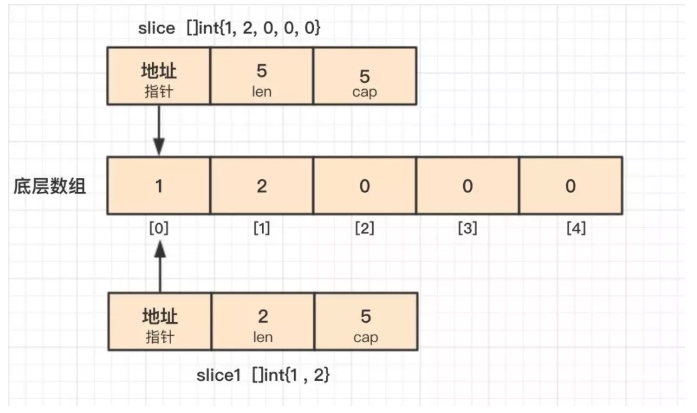

# Go语言面试题

[go语言面试题](https://www.topgoer.cn/docs/gomianshiti/mian1)

## day01 

[day01](./src/day01/main.go)

defer 的执行顺序是后进先出。当出现 panic 语句的时候，会先按照 defer 的后进先出的顺序执行，最后才会执行panic

## day02

[day01](./src/day02/main.go)

这是新手常会犯的错误写法，for range 循环的时候会创建每个元素的副本，而不是元素的引用，所以 m[key] = &val 取的都是变量 val 的地址，
所以最后 map 中的所有元素的值都是变量 val 的地址，因为最后 val 被赋值为3，所有输出都是3.

## day03

+ 1. [day03](./src/day03/main.go)
+ 2. new和make的区别

new(T) 和 make(T,args) 是 Go 语言内建函数，用来分配内存，但适用的类型不同。

new(T) 会为 T 类型的新值分配已置零的内存空间，并返回地址（指针），即类型为 *T的值。换句话说就是，返回一个指针，该指针指向新分配的、类型为 T 的零值。适用于值类型，如数组、结构体等。

make(T,args) 返回初始化之后的 T 类型的值，这个值并不是 T 类型的零值，也不是指针 *T，是经过初始化之后的 T 的引用。make() 只适用于 slice、map 和 channel.

## day04

[test01](./src/day04/test01/main.go)

能通过编译，new([]int) 之后的 list 是一个 *[]int 类型的指针，不能对指针执行 append 操作。可以使用 make() 初始化之后再用。
同样的，map 和 channel 建议使用 make() 或字面量的方式初始化，不要用 new() 。

[test02](./src/day04/test02/main.go)

不能通过编译。append() 的第二个参数不能直接使用 slice，需使用 … 操作符，将一个切片追加到另一个切片上：append(s1,s2…)。
或者直接跟上元素，形如：append(s1,1,2,3)。

[test03](./src/day04/test03/main.go)

简短模式原则：
+ 1.必须使用显示初始化；
+ 2.不能提供数据类型，编译器会自动推导；
+ 3.只能在函数内部使用简短模式；

## day05

[day05](./src/day05/main.go)

+ 结构体只能比较是否相等，但是不能比较大小。
+ 相同类型的结构体才能够进行比较，结构体是否相同不但与属性类型有关，还与属性顺序相关，sn3 与 sn1 就是不同的结构体；
    ```go
       sn3:= struct {
                  name string
                  age  int
              }{age:11,name:"qq"}
    ```
+ 如果 struct 的所有成员都可以比较，则该 struct 就可以通过 == 或 != 进行比较是否相等，比较时逐个项进行比较，如果每一项都相等，则两个结构体才相等，否则不相等；

## day06

+ 1. 通过指针变量 p 访问其成员变量 name，有哪几种方式？

`p.name`
`(*p).name`

+ 2. [day06](./src/day06/main.go)

第 5 行代码是基于类型 int 创建了新类型 MyInt1，第 6 行代码是创建了 int 的类型别名 MyInt2，注意类型别名的定义时 = 。
所以，第 10 行代码相当于是将 int 类型的变量赋值给 MyInt1 类型的变量，Go 是强类型语言，编译当然不通过；而 MyInt2 只是 int 的别名，本质上还是 int，可以赋值。

第 10 行代码的赋值可以使用强制类型转化 var i1 MyInt1 = MyInt1(i).

## day07
+ 1. 字符串连接

`str := "abc" + "123"`
`fmt.Sprintf("abc%d",123)`

字符串连接。除了以上两种连接方式，还有 strings.Join()、buffer.WriteString()等。

+ 2. [day07](./src/day07/main.go)

iota是golang语言的常量计数器,只能在常量的表达式中使用。const中每新增一行常量声明将使iota计数一次(iota可理解为const语句块中的行索引)。

+ 3. nil 只能赋值给指针、chan、func、interface、map 或 slice 类型的变量。

## day08

### 关于init()函数

+ init() 函数是用于程序执行前做包的初始化的函数，比如初始化包里的变量等;
+ 一个包可以出现多个 init() 函数,一个源文件也可以包含多个 init() 函数；
+ 同一个包中多个 init() 函数的执行顺序没有明确定义，但是不同包的init函数是根据包导入的依赖关系决定的（看下图）;
+ init() 函数在代码中不能被显示调用、不能被引用（赋值给函数变量），否则出现编译错误;
+ 一个包被引用多次，如 A import B,C import B,A import C，B 被引用多次，但 B 包只会初始化一次；
+ 引入包，不可出现死循坏。即 A import B,B import A，这种情况编译失败；


### 函数赋值

[test01](./src/day08/test01/main.go)

hello() 赋值给变量 h，而不是函数的返回值，所以输出 not nil。

### 类型选择

[test02](./src/day08/test02/main.go)

类型选择，类型选择的语法形如：i.(type)，其中 i 是接口，type 是固定关键字，
需要注意的是，只有接口类型才可以使用类型选择。看下关于接口的文章。

## day09

### channel的正确写法

`var ch chan int`

`ch := make(chan int)`

`<- ch`

注：写channel `ch <- ` 必须带上值

### map的返回值

[test01](./src/day09/test01/main.go)

打印一个 map 中不存在的值时，返回元素类型的零值。这个例子中，m 的类型是 map[person]int，
因为 m 中不存在 p，所以打印 int 类型的零值，即 0。

### 可变函数

[test02](./src/day09/test02/main.go)

## day10

+ 两个不同类型的数值不能相加

```go
    func main() {  
        a := 5
        b := 8.1
        fmt.Println(a + b)
    }
```
+ 截取操作符

[day10](./src/day10/main.go)

截取操作符还可以有第三个参数，形如 [i,j,k]，第三个参数 k 用来限制新切片的容量，但不能超过原数组（切片）的底层数组大小。
截取获得的切片的长度和容量分别是：j-i、k-i。


+ Go语言中的比较

Go 中的数组是值类型，可比较，另外一方面，数组的长度也是数组类型的组成部分，所以 a 和 b 是不同的类型，是不能比较的，
所以编译错误。


## day16

数组或切片的截取操作。截取操作有带 2 个或者 3 个参数，形如：[i:j] 和 [i:j:k]，假设截取对象的底层数组长度为 l。
在操作符 [i:j] 中，如果 i 省略，默认 0，如果 j 省略，默认底层数组的长度，截取得到的切片长度和容量计算方法是 j-i、l-i。
操作符 [i:j:k]，k 主要是用来限制切片的容量，但是不能大于数组的长度 l，截取得到的切片长度和容量计算方法是 j-i、k-i。


## day21

`永远不要使用一个指针指向一个接口类型，因为它已经是一个指针。`


## day31

[test01](./src/day31/test01/main.go)

可变函数、append()操作。Go 提供的语法糖…，可以将 slice 传进可变函数，不会创建新的切片。
第一次调用 change() 时，append() 操作使切片底层数组发生了扩容，原 slice 的底层数组不会改变；
第二次调用change() 函数时，使用了操作符[i,j]获得一个新的切片，假定为 slice1，它的底层数组和原切片底层数组是重合的，
不过 slice1 的长度、容量分别是 2、5，所以在 change() 函数中对 slice1 底层数组的修改会影响到原切片。



